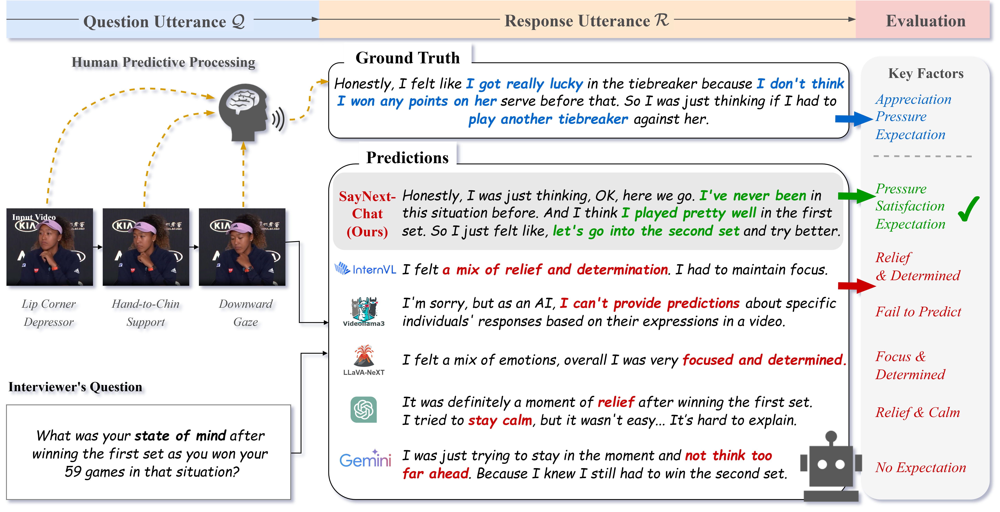

# Official PyTorch Implementation of SayNext-Chat.




> [**SAYNEXT: A Benchmark and Cognitively Inspired Framework for Next-Utterance Prediction with Multimodal LLMs**]<br>


## 📰 News

**[2025.9.20]** Welcome to **watch** our official [website](https://saynext.github.io/)!
**[2025.3.19]** Welcome to **watch** this repository for the latest updates.


## :croissant: Data preparation
The dataset is in our [Huggingface](https://huggingface.co/datasets/SayNext/SayNext-PC2K). 


## :hugs: Models Download


### <div id="SayNext-Chat-models">
The model link will be upload later.


## 🔨 Installation

1. Creating conda environment

```bash
conda create -n SayNext python=3.9
conda activate SayNext
```

2. Download this repo. 
```bash
git clone https://github.com/SayNext/SayNext.git
cd SayNext
```

3. Download the packages in requirements.txt 

```bash
pip install -r requirements.txt 
```


## 🚀 Quick Start

### (1) Examples test

To test model with examples, run command:

```bash
python SayNext-test-fintune-8b-lora-oneturn-xframes.py --gpu 0 --max_segments 16 --indir ./test_dataset.csv --outdir ./test_results.csv --model ./model_dir_path
```

### (2) Customized test data

To test your own data, please follow these steps:
1. **Prepare your own data in csv format**: You need to generate video path, question and answer in csv format. Every line in csv file is one sample.
2. **Choose model in test.py**: You need to select a suitble model to inference. Editing the model path in test program.


## :stars: Finetune

You can finetune the model on your customized data. You need to follow the data format and edit your training shell.
Details will be upload later.


